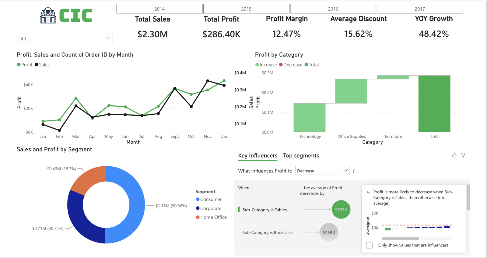
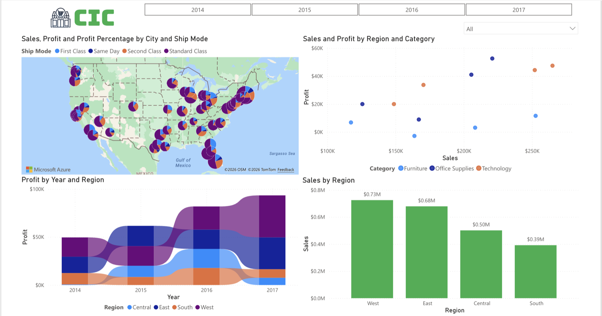

# CEO Sales & Profit Dashboard (Power BI)

An interactive executive dashboard for a fictional retailer, **"Chetan in Cork" (CIC)**, built on the Superstore dataset. It lets a CEO read performance in seconds and drill through to plan targeted campaigns.

**Tools:** Power BI Desktop · Power Query (M) · DAX · Power BI Service

<!-- Add screenshots: open the .pbix, export each page as an image to images/, then uncomment:

-->

## Dataset
[Sample Superstore](https://www.kaggle.com/datasets/vivek468/superstore-dataset-final) (Kaggle): 9,994 US orders, 2014–2017, covering orders, customers, geography, a product hierarchy and financials.

## BI development cycle
Data gathering → understanding → validation → **Power Query wrangling** (mixed-locale date parsing, derived date columns, CIC rebranding) → **DAX measures** → dashboard design → publishing to Power BI Service.

## Report pages
1. **Sales & Profit Overview:** six KPI cards (Sales, Profit, Margin %, Orders, Avg Discount %, YoY Growth), a monthly sales/profit trend, a profit waterfall by category, a segment donut and the **Key Influencers** AI visual
2. **Geographic & Regional Analysis:** map and regional breakdowns. They show the **South trailing the West by about $400K**
3. **Drill-through: Campaign Planning:** detail page for planning targeted campaigns

All pages share a synchronised Year-Month slicer and a custom CIC theme.

## Files
| Path | Contents |
|---|---|
| `superstore_ceo_dashboard.pbix` | Power BI report (open with Power BI Desktop) |
| `report/report.pdf` | Design write-up: decisions, DAX details, design considerations |

---
*MSc Data Science & Analytics, Munster Technological University (Data Visualisation)*
